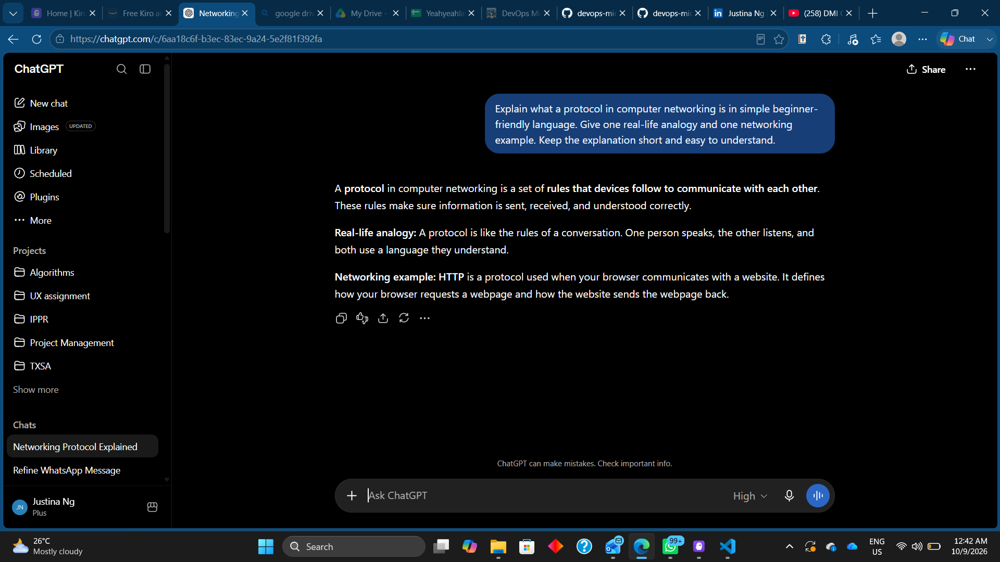
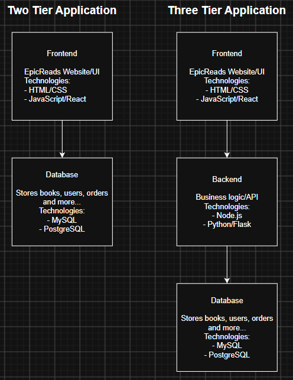
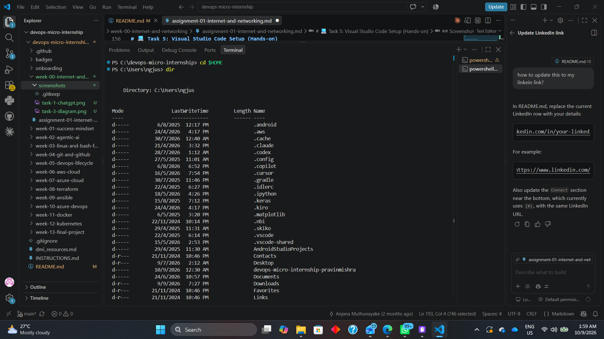

# Week 00 - Internet and Networking

Part of the DevOps Micro Internship (DMI) Cohort 3 with Agentic AI

---

# 🧑‍💻 Task 1: Using ChatGPT as Your Learning Assistant

## Scenario

You're new to DevOps and will frequently encounter technical questions. ChatGPT can be your learning companion.

## Your Task

Write a clear ChatGPT prompt to help you understand:

> "What is a protocol in networking? Explain with a simple real-life example."

Take a screenshot of your interaction showing:

* Your detailed prompt (with clear expectations)
* ChatGPT's simplified response with an example

## Screenshot

Save your screenshot in the `screenshots` folder and update the file name below.




Replace `task-1-chatgpt.png` with your actual screenshot file name.

---

## What I Learned (2–3 lines)

I learned that a protocol is a set of rules that allows devices to communicate with each other correctly. I also learned that HTTP is an example of a networking protocol used between a web browser and a website.

---

# 🌐 Task 2: Internet and Networking

## Scenario

Your friend is launching an online bookstore named **EpicReads**.

He asked you to explain how users globally can access his website hosted in Finland.

## Your Task

Write a short explanation (**100–150 words**) that includes:

* Packet Switching
* IP Address
* TCP/IP
* HTTP/HTTPS

💡 **Tip:** You may use ChatGPT (as demonstrated in Task 1) to refine your explanation.

## Answer

When users around the world access the EpicReads website hosted in Finland, the internet sends data using packet switching. This means the website data is broken into small packets that may travel through different routes before reaching the user.

The EpicReads server has an IP address, which acts like a unique address so devices on the internet know where to send requests. Communication between the user’s device and the server follows TCP/IP rules. IP helps deliver the packets to the correct destination, while TCP makes sure the packets arrive correctly and in the right order.

When users open EpicReads in a web browser, HTTP or HTTPS is used to request and receive web pages. HTTPS is more secure because it encrypts the data exchanged between the user and the website.


---

# 🏗️ Task 3: Application Architecture & Stack

## Scenario

EpicReads bookstore has two application versions:

### Two-Tier Application

* Frontend
* Database

### Three-Tier Application

* Frontend
* Backend
* Database

## Your Task

* Draw simple diagrams (hand-drawn or tool-based such as draw.io)
* Label each layer clearly
* List at least two common technologies or tools used for each layer
* Submit a screenshot or photo clearly showing your own drawing

## Diagram Screenshot / Photo

Save your diagram image in the `screenshots` folder and update the file name below.




Replace `task-3-diagram.png` with your actual diagram file name.

---

## Technologies Used

### Frontend

* HTML/CSS
* JavaScript/React

### Backend

* Node.js
* Python/Flask

### Database

* MySQL
* PostgreSQL

---

# 🌍 Task 4: Domain Name & DNS (Basic Concepts)

## Scenario

Your friend's bookstore **EpicReads** is currently accessible through:

```text
52.172.142.222:3000
```

He purchased the domain:

```text
epicreads.com
```

## Your Task

In **50–100 words**, explain in your own words:

1. What is DNS (Domain Name System)?
2. Which DNS record type should be used to connect the domain to the given IP, and why?

## Answer

DNS (Domain Name System) is like the internet’s phonebook. It translates an easy-to-remember domain name, such as epicreads.com, into the server’s IP address so users do not need to remember numbers.

For EpicReads, an A record should be used because the server uses an IPv4 address, 52.172.142.222. The A record connects epicreads.com to this IP address. DNS only maps the domain to the IP; the port 3000 is handled separately by the web server or application.

---

# 💻 Task 5: Visual Studio Code Setup (Hands-on)

## Your Task

Install Visual Studio Code (if not already installed).

Take a screenshot of your VS Code environment showing:

* Terminal open inside VS Code
* Running a basic command:

### Windows

```powershell
dir
```

### Linux / macOS

```bash
pwd
ls
```

* Your selected VS Code theme clearly visible

⚠️ **Important:** The screenshot must show your username or another identifiable detail to confirm it is your environment.

## Screenshot

Save your screenshot in the `screenshots` folder and update the file name below.




Replace `task-5-vscode.png` with your actual screenshot file name.

---

# 🔗 Task 6: Publish Your Assignment as a LinkedIn Post

## Objective

Publishing on LinkedIn helps you:

* Build your professional online presence
* Reinforce your learning
* Document your DevOps journey publicly

## Your Task

Summarize your answers from Tasks 1–5 into a LinkedIn post.

Clearly structure your post into the following sections:

* ChatGPT
* Internet & Networking
* App Architecture
* DNS
* VS Code Setup

Use the credit note that matches your track:

Add the following credit note at the end of your post **(If you are DMI Cohort 3 student)**:

> **P.S. This post is part of the DevOps Micro Internship (DMI) with Agentic AI — Cohort 3 — by Pravin Mishra. My graded progress is public: https://dmi.pravinmishra.com/s/YOUR-GITHUB-USERNAME.html · Start your DevOps journey: https://dmi.pravinmishra.com/?utm_source=student&utm_medium=ps-linkedin&utm_campaign=cohort3**


Add the following credit note at the end of your post **(If you are DMI Self-paced track student)**:

> **P.S. This post is part of the DevOps Micro Internship (DMI) — Self-Paced Engineer Track — by Pravin Mishra. My graded progress is public: https://dmi.pravinmishra.com/s/YOUR-GITHUB-USERNAME.html · Start your DevOps journey: https://dmi.pravinmishra.com/?utm_source=student&utm_medium=ps-linkedin&utm_campaign=self-paced**

Add the following credit note at the end of your post **(If you are DMI Campus student)**:

> **P.S. This post is part of the DevOps Micro Internship (DMI) — Campus — by Pravin Mishra. My graded progress is public: https://dmi.pravinmishra.com/s/YOUR-GITHUB-USERNAME.html · Start your DevOps journey: https://dmi.pravinmishra.com/?utm_source=student&utm_medium=ps-linkedin&utm_campaign=campus**

Replace `YOUR-GITHUB-USERNAME` with your GitHub username — that link is your public DMI progress page (your graded badge page).
---

## LinkedIn Post URL

Paste your LinkedIn post URL here:

```text
https://lnkd.in/p/gnA9Yrvm
```

---

## LinkedIn Post Backup Copy

Paste the full text of your LinkedIn post here:

🌐 Week 0 – DevOps Micro Internship: Internet & Networking

I’ve completed Week 0 of my DevOps Micro Internship journey, where I learned some of the fundamental concepts behind networking, application architecture, DNS, and development tools.

🤖 ChatGPT
I learned how to write a clear prompt and use ChatGPT to simplify technical concepts. I explored networking protocols and learned that a protocol is a set of rules devices follow to communicate with each other.

🌐 Internet & Networking
I learned how websites can be accessed globally through concepts such as packet switching, IP addresses, TCP/IP, and HTTP/HTTPS. Packet switching breaks information into smaller packets, while TCP/IP helps deliver them correctly between devices.

🏗️ App Architecture
I explored the difference between two-tier and three-tier application architectures. A two-tier application connects the frontend directly to the database, while a three-tier architecture adds a backend layer between the frontend and database.

🌍 DNS
I learned that DNS works like the internet’s phonebook by translating domain names into IP addresses. I also learned that an A record is used to connect a domain name to an IPv4 address.

💻 VS Code Setup
I practiced using the integrated terminal in Visual Studio Code and ran basic PowerShell commands such as dir to view files and directories on my computer.
 
Looking forward to building on these foundations as I continue learning DevOps! 🚀

P.S. This post is part of the DevOps Micro Internship (DMI) with Agentic AI — Cohort 3 — by Pravin Mishra. My graded progress is public:
https://lnkd.in/gis89ZgM
Start your DevOps journey:
https://lnkd.in/g7pJEEeB

#DevOps #DMI #Networking #CloudComputing #LearningJourney #VisualStudioCode #DNS

---

# Reflection – Week 0

### What did you find easy?

I found the basic networking concepts and VS Code setup easy to understand. Creating the application architecture diagrams also helped me clearly see the difference between two-tier and three-tier applications.

---

### What was difficult?

I found some networking terms, especially TCP/IP, packet switching, and DNS records, slightly difficult at first because I learned this long time ago. However, using simple examples reminded me and helped me understand them better.

---

### What will you improve next week?

Next week, I want to improve my understanding of DevOps concepts by doing more hands-on practice. I also want to become more confident using the GitHub commands instead of searching over the commands using ChatGPT or Google.

---

## 📌 About DMI & CloudAdvisory

DevOps Micro Internship (DMI) is a project-based DevOps program run by Pravin Mishra (The CloudAdvisory) focused on real-world execution, systems thinking, and career readiness.

It helps learners build strong DevOps foundations with hands-on experience.


## 📌 Resources

- 🌐 **DMI Official Website:** https://dmi.pravinmishra.com?utm_source=github&utm_medium=readme  
- 🎓 **University:** https://university.pravinmishra.com?utm_source=github&utm_medium=readme  
- 💬 **Discord Community:** https://discord.pravinmishra.com?utm_source=github&utm_medium=readme  
- 📝 **Blog:** https://dmi.pravinmishra.com/blog?utm_source=github&utm_medium=readme  
- ▶️ **YouTube Playlist (DMI Cohort 3):** https://www.youtube.com/playlist?list=PLFeSNDtI4Cho  
- 🔗 **Pravin Mishra (LinkedIn):** https://www.linkedin.com/in/pravin-mishra-aws-trainer/  
- 🏢 **CloudAdvisory (LinkedIn):** https://www.linkedin.com/company/thecloudadvisory/

---

*This submission is part of DevOps Micro Internship (DMI) Cohort 3 — Agentic AI Track*